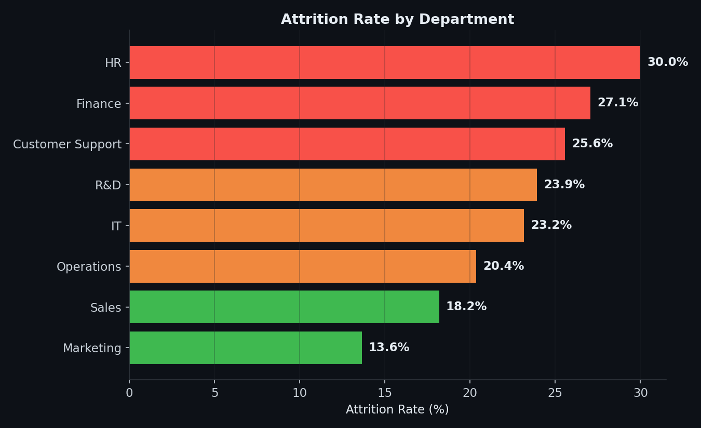
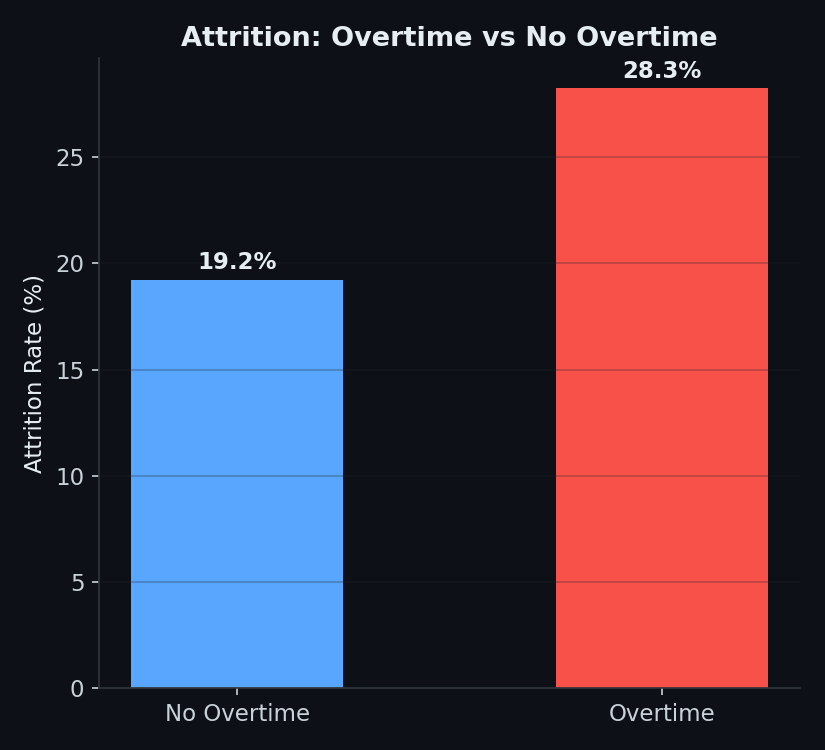
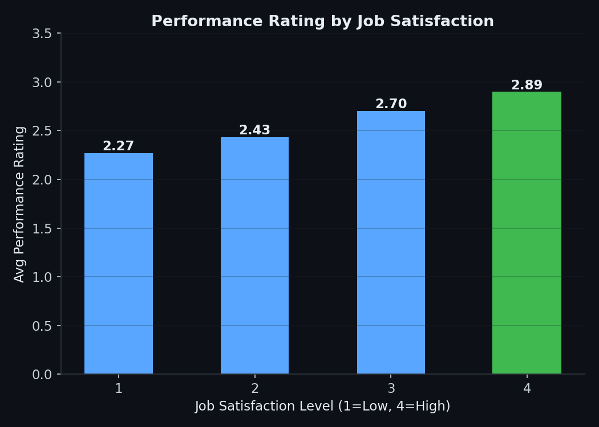
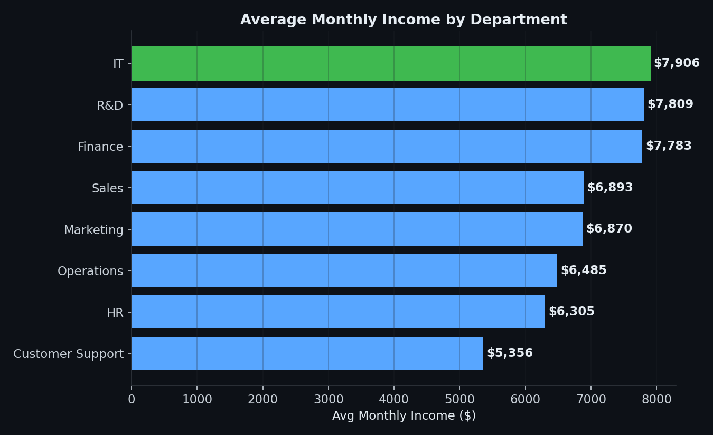

# Employee Performance Metrics (Power BI)

End-to-end HR analytics project tracking employee performance,
attrition risk, and compensation patterns across an 800-employee
simulated dataset modeled on the [IBM HR Analytics Employee
Attrition & Performance dataset](https://www.kaggle.com/rhuebner/human-resources-data-set)
schema.

> **Note on data:** Kaggle requires authenticated download, not
> reachable from this environment. `generate_data.py` builds a
> synthetic dataset with the same column structure and — critically —
> realistic relationships between variables (attrition is driven by
> satisfaction, overtime, and pay, not random noise), calibrated to a
> ~20% attrition rate in line with published benchmarks. Swap in the
> real Kaggle CSV and every measure/visual below works unchanged,
> provided column names match.

## Project Structure
```
powerbi-employee-performance/
├── generate_data.py          # builds employee_performance.csv
├── employee_performance.csv  # 800-row dataset, ready to import into Power BI
├── dax_measures.txt          # all DAX measures and calculated columns to paste in
├── dashboard_blueprint.md    # page-by-page layout: what visual goes where and why
├── images/                   # chart previews of the key findings (see below)
└── README.md
```

## How to Build the Dashboard
1. Open Power BI Desktop → **Get Data** → **Text/CSV** → select `employee_performance.csv`
2. In **Power Query Editor**, confirm column types: `MonthlyIncome`, `Age`, `DistanceFromHome`, `YearsAtCompany`, etc. as Whole Number; `Attrition`, `OverTime`, `BusinessTravel`, `Department` as Text
3. Load the data, then go to **Modeling → New Measure** and paste in each measure from `dax_measures.txt`
4. For `FlightRiskScore` and `FlightRiskTier`, use **Modeling → New Column** instead (they're row-level, not aggregations)
5. Follow `dashboard_blueprint.md` page by page to lay out visuals

## Key Tasks Covered
- Attrition rate tracking, sliced by department, overtime status, and travel frequency
- A custom **Flight Risk Score** (calculated column) combining satisfaction, work-life balance, overtime, and travel into a single 0-15+ risk index — bucketed into High/Medium/Low tiers
- Performance rating trends against job satisfaction and involvement
- Compensation benchmarking by department
- Drill-through design from department summary to individual flight-risk lists

## Insights (from actual data analysis)



- **HR has the highest attrition rate at 30.0%**, more than double Marketing's 13.6% — the lowest. Finance (27.1%) and Customer Support (25.6%) also run well above the company average of 21.8%.



- **Employees working overtime leave at 28.3% vs 19.2% for those who don't** — a 9-point gap, and one of the clearest single levers HR has for reducing attrition (overtime policy review, workload redistribution).



- **Performance rating climbs steadily with job satisfaction** — from 2.27 average at the lowest satisfaction level to 2.89 at the highest. This is a case where engagement and output move together, reinforcing that satisfaction isn't just a retention lever, it's a performance one too.



- **IT ($7,906), R&D ($7,809), and Finance ($7,783) pay the highest average salaries**, while Customer Support trails significantly at $5,356 — a 48% gap between the top and bottom department. Worth cross-referencing against Customer Support's above-average attrition rate (25.6%).

**Other findings:**
- Frequent travelers attrit at 26.9% vs 18.6% for non-travelers — a smaller but still meaningful gap.
- High performer rate (rating ≥3) varies less by department than attrition does (49.5%–60.5% range), suggesting performance is more evenly distributed than retention risk — attrition is the more department-specific problem to solve.

## Suggested Next Steps
- Add a what-if parameter for overtime hours to model attrition-rate sensitivity.
- Build a second page focused purely on compensation equity (income by gender, by role, controlling for tenure).
- Swap in the real Kaggle CSV when available — schema and all measures apply unchanged.
